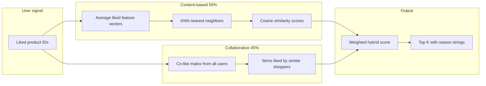
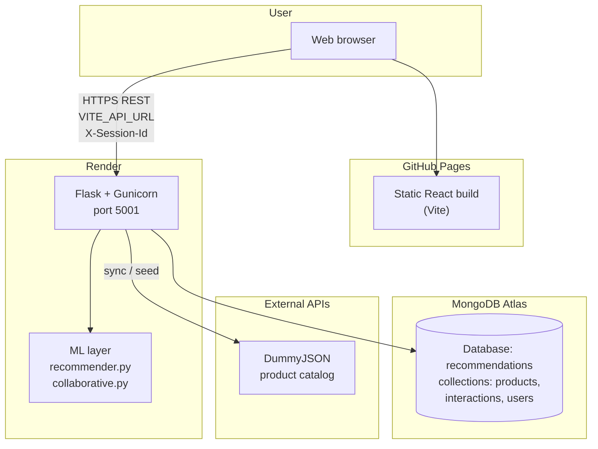
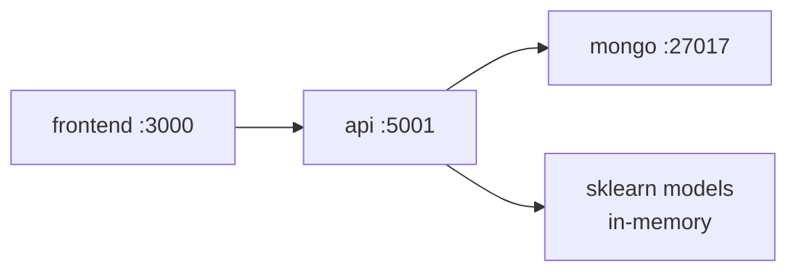
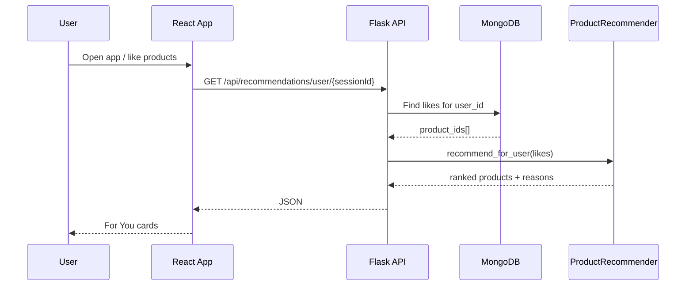

# AI-Powered Product Recommendation Engine

A full-stack product discovery app with **personalized recommendations**, **smart search**, and **similar-item insights**. Users browse a live catalog, build a taste profile from likes, and get a **hybrid** feed that blends content-based ML with collaborative filtering.

| | Link |
|--|------|
| **Live app** | https://googlesgit.github.io/ai-product-recommendation-engine/ |
| **Deploy guide** | [docs/DEPLOY.md](docs/DEPLOY.md) |
| **Learning path** | [docs/LEARNING.md](docs/LEARNING.md) |

**Stack:** React (Vite) · Flask REST API · MongoDB · scikit-learn · Docker · GitHub Pages · Render · Atlas

---

## What the app does (for users)

| Feature | What you see | What happens behind the scenes |
|---------|----------------|--------------------------------|
| **Browse catalog** | ~194 products with images, prices, ratings; category chips; **Load more** pagination | Products stored in MongoDB; synced from [DummyJSON](https://dummyjson.com/products) |
| **Search** | Type e.g. `iphone`, `headphones` — debounced results + quick-search chips | Multi-token relevance scoring; category hints for queries like `iphone` → smartphones |
| **For You** | Personalized row after you ♥ items | **Hybrid ranker:** 55% content similarity + 45% item–item collaborative filtering |
| **Similar items** | Panel when you click a product | Cosine similarity on engineered product feature vectors |
| **Recently viewed** | Your last browsed products (session only) | `view` events stored with timestamps |
| **Try sample** | Alex / Jordan / Sam demo profiles | Pre-seeded likes by category for instant recommendations |
| **Session** | Anonymous profile per browser; like/view counts in header | `sess_<uuid>` in `localStorage`, sent as `X-Session-Id` on every API call |

**Cold start:** New visitors with no likes see **trending** products (high rating + review count).

---

## How it works (technical overview)

### 1. Catalog pipeline

1. On first deploy (or when the DB is outdated), the API runs **`sync_catalog.py`**.
2. It fetches **all 194 products** from DummyJSON (paginated API calls).
3. Each product is normalized: `name`, `description`, `price`, `rating`, `category_slug`, `image_url`, `brand`, etc.
4. Documents are **upserted** into MongoDB (`source: dummyjson`).
5. Demo users get sample **likes** via `seed_data.py` so collaborative filtering has signal.

### 2. Session & interactions

```
Browser                    Flask API                 MongoDB
   |  X-Session-Id: sess_…     |                        |
   |  POST /api/interactions   |  insert {user_id,       |
   |  { type: like|view }      |    product_id, type}   |
   |-------------------------->|----------------------->|
```

- **Likes** drive **For You** (and refresh the CF matrix).
- **Views** power **Recently viewed** only.

### 3. Recommendation pipeline (hybrid)



**Content features** (per product): log-scaled price, normalized rating, review signal, category one-hot, TF-IDF on name + description + brand.

**Collaborative:** Users who liked the same products boost related items (item–item co-likes).

### 4. Search

1. Load catalog from MongoDB.
2. Score each product: phrase match, per-token match on name/category/brand/description.
3. If strict match fails → looser OR match → category hints (e.g. `iphone` → `smartphones`).

### 5. Similar products

Precomputed **cosine similarity matrix** over the same feature vectors; return top-*k* neighbors excluding the source product.

---

## Architecture

### Production (live demo)



| Layer | Host | Role |
|-------|------|------|
| **Frontend** | GitHub Pages | SPA only — no server logic; calls Render API |
| **API** | Render (free tier) | REST routes, ML inference, catalog sync |
| **Database** | MongoDB Atlas | Persistent catalog + events |
| **Catalog source** | DummyJSON | Upstream product feed (~194 items) |

> GitHub Pages cannot run Python or MongoDB. The browser talks to **Render** for all data and recommendations.

### Local development (Docker)



```bash
docker compose up --build
# → http://localhost:3000  (UI)
# → http://localhost:5001/api/health  (API)
```

### Request flow (example: get recommendations)



---

## Repository map (what is what)

```
ai-product-recommendation-engine/
├── frontend/                    # React UI (Vite)
│   ├── src/App.jsx              # Main page: search, For You, catalog, sessions
│   ├── src/components/          # ProductCard, SearchBar, Toast
│   └── src/services/
│       ├── api.js               # REST client → VITE_API_URL
│       └── session.js           # sess_* id + X-Session-Id header
│
├── backend/
│   ├── app.py                   # Flask entry, CORS, auto catalog migrate
│   ├── routes/api.py            # All /api/* endpoints
│   ├── models/
│   │   ├── recommender.py       # Feature engineering, KNN, hybrid blend
│   │   └── collaborative.py     # Item–item CF from co-likes
│   ├── services/
│   │   ├── database.py          # MongoDB connection (certifi for Atlas TLS)
│   │   ├── search.py            # Multi-token search + category hints
│   │   ├── session.py           # Session users + stats
│   │   └── catalog.py           # Detect legacy / partial catalog
│   └── scripts/
│       ├── sync_catalog.py      # DummyJSON → MongoDB (all pages)
│       ├── seed_data.py         # Demo users + category-based likes
│       └── evaluate_model.py    # Offline Precision@K eval
│
├── docker-compose.yml           # mongo + api + frontend
├── render.yaml                  # Render Blueprint deploy
├── .github/workflows/           # Deploy frontend to GitHub Pages
└── docs/
    ├── DEPLOY.md                # Pages + Render + Atlas setup
    └── LEARNING.md              # Study guide
```

| File / folder | Responsibility |
|---------------|----------------|
| `sync_catalog.py` | Pull 194 products from DummyJSON; upsert; optional `--drop-legacy` |
| `recommender.py` | Fit vectors, similar products, hybrid **For You** |
| `collaborative.py` | Build co-like graph from `type: "like"` interactions |
| `api.py` | HTTP layer; refreshes in-memory model after likes / sync |
| `App.jsx` | Wires UI to API: pagination, categories, search, profile modes |

---

## API reference

| Method | Path | Purpose |
|--------|------|---------|
| GET | `/api/health` | Status + `product_count` |
| GET/POST | `/api/seed` | Load/upgrade catalog (`?force=true` on production) |
| POST | `/api/catalog/sync` | Refresh from DummyJSON (`?drop_legacy=true`) |
| GET | `/api/products/categories` | Category list for filters |
| GET | `/api/products?page=&limit=&category=` | Paginated browse |
| GET | `/api/products/search?q=` | Smart search |
| GET | `/api/products/search/suggestions?q=` | Autocomplete hints |
| GET | `/api/products/<id>` | Single product |
| GET | `/api/similar/<id>?k=5` | Similar products + scores |
| GET | `/api/recommendations/user/<id>?k=8` | Hybrid personalized feed |
| GET/POST | `/api/session` | Session stats (likes, views) |
| GET | `/api/interactions/recent` | Recently viewed |
| GET | `/api/users/demo` | Demo personas |
| POST | `/api/interactions` | Record `like` \| `view` \| `click` \| `purchase` |

---

## Quick start (local)

```bash
docker compose up --build
open http://localhost:3000
```

If the catalog looks wrong (e.g. **148** products = old partial sync + legacy seed):

```bash
docker compose up --build -d api
docker compose exec api python scripts/sync_catalog.py --drop-legacy
docker compose exec api python scripts/seed_data.py
docker compose restart api
```

Expect **`product_count`: 194** at http://localhost:5001/api/health.

**Without Docker:** see [docs/DEPLOY.md](docs/DEPLOY.md) and run `sync_catalog.py` → `seed_data.py` → `app.py` + `npm start` in `frontend/`.

---

## Production checklist

1. Deploy API to **Render** with `MONGO_URI` (Atlas).
2. Set GitHub Actions variable **`VITE_API_URL`** = `https://YOUR-SERVICE.onrender.com/api`.
3. Enable **GitHub Pages** from Actions workflow.
4. Upgrade catalog once: `GET /api/seed?force=true` (should return ~194 products).

---

## Offline evaluation

```bash
cd backend && python scripts/evaluate_model.py
```

Compares **baseline** (price + rating only) vs **engineered features** using Precision@5 on held-out likes. Use the printed number on your resume (run locally after demo users are seeded).

---

## Resume mapping

| Bullet | Where in code |
|--------|----------------|
| React + Flask REST | `frontend/`, `backend/routes/api.py` |
| Hybrid recommendations | `recommender.py` + `collaborative.py` |
| Feature engineering + KNN + cosine | `recommender.py` |
| MongoDB event store | `database.py`, `interactions` collection |
| Dockerized stack | `docker-compose.yml` |
| CI/CD (Pages) | `.github/workflows/deploy-frontend.yml` |

---

## Interview quick answers

1. **Architecture?** React static UI → Flask API → MongoDB; ML runs in API process (in-memory matrices refit on sync/like).
2. **Content vs collaborative?** Content = product features + your likes; CF = “users who liked X also liked Y.”
3. **Why cosine?** Measures taste *direction*, not raw price scale.
4. **Cold start?** Popular/trending until the user likes items.
5. **How evaluate?** Hold out 20% of likes per user; Precision@5 — see `evaluate_model.py`.

---

## What's next (optional)

- Scheduled catalog sync · Redis cache · matrix factorization · real auth · admin CSV upload · MongoDB text indexes

See conversation / issues for roadmap; core **Phase 1 + Milestones A & C** are complete.
